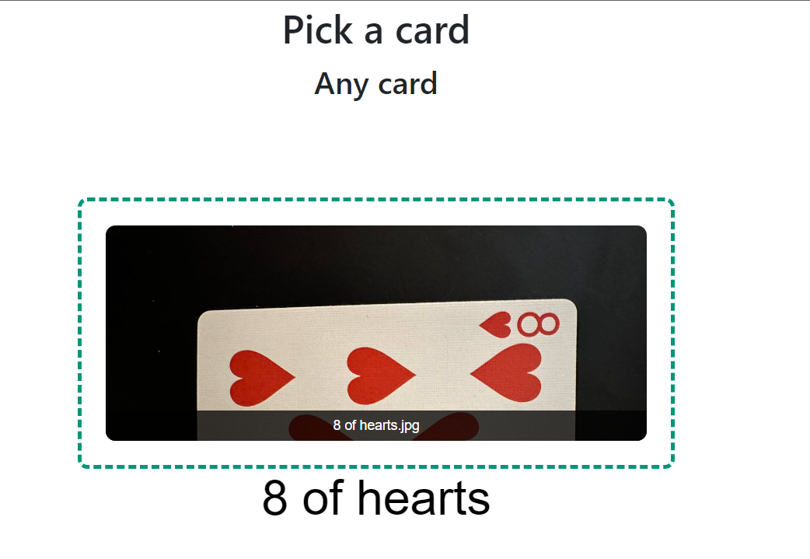

# LW4

## Задание
Создать прикладную систему компьютерного зрения
1. Выбрать и зафиксировать тему проекта.
2. Разработать требования к системе.
3. Разработать архитектуру системы.
4. Реализовать систему с использованием ИИ и компьютерного зрения.
5. Оценить потребление ресурсов при функционировании системы и 
технические характеристики
## Модель
В ходе работы была создана и обучена модель компьютерного зрения, распознающая игральные карты на фотографии. 
Модель обучалась на аугментированном датасете из 50 карт. Notebook с кодом есть в репозитории.
Архитектура модели:
Model: "sequential"

| Layer (type)                   | Output Shape         | Param # |
|--------------------------------|----------------------|---------|
| conv2d (Conv2D)                | (None, 178, 178, 64) | 640     |
| max_pooling2d (MaxPooling2D)   | (None, 89, 89, 64)   | 0       |
| conv2d_1 (Conv2D)              | (None, 87, 87, 64)   | 36928   |
| max_pooling2d_1 (MaxPooling2D) | (None, 43, 43, 64)   | 0       |
| conv2d_2 (Conv2D)              | (None, 41, 41, 128)  | 73856   |
| max_pooling2d_2 (MaxPooling2D) | (None, 20, 20, 128)  | 0       |
| conv2d_3 (Conv2D)              | (None, 18, 18, 128)  | 147584  |
| max_pooling2d_3 (MaxPooling2D) | (None, 9, 9, 128)    | 0       |
| flatten (Flatten)              | (None, 10368)        | 0       |
| dropout (Dropout)              | (None, 10368)        | 0       |
| dense (Dense)                  | (None, 512)          | 5308928 |
| dense_1 (Dense)                | (None, 52)           | 26676   |

Total params: 5,594,612

Accuracy во время обучения: 

## Интерфейс

Для работы модели был разработан веб-интерфейс с формой отправки фотографии с помощью библиотеки fastAPI.

Стартовая страница предлагает выбрать карту

После обработки интерфейс показывает предсказанный класс

## Потребление ресурсов
| Действие                                | Время    | Память                                       |
|-----------------------------------------|----------|----------------------------------------------|
| Обучение (20 эпох, RTX3060)             | <= 1 мин | до 16 GB RAM + 12 GB VRAM в зависимости от параметров |
| Инференс (с учетом веб-интерфейса CPU ) | 0.054 с  | 800 MiB                                      |
 
Следует отметить, что модель весит 42 МБ при весе весов в 180 КБ

## Сорсы
- Szegedy, Christian (2015). "Going deeper with convolutions"
- https://medium.com/swlh/image-classification-for-playing-cards-26d660f3149e
